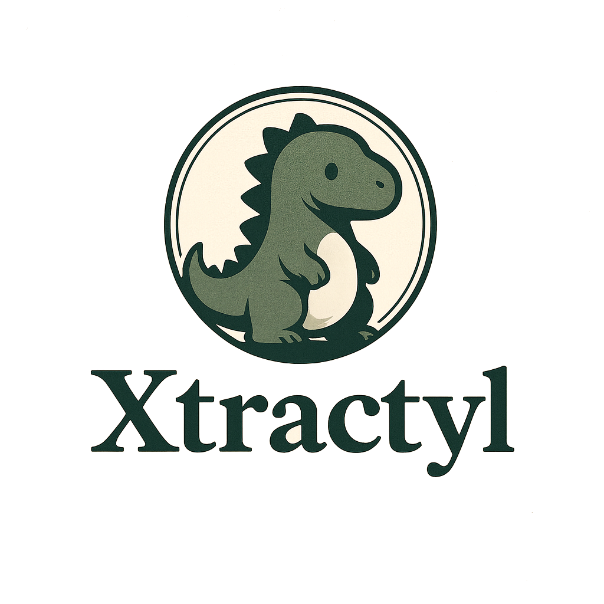

  

<h3 align="center">
Local, privacy-first AI training infrastructure for regulated environments.
</h3>

  🌐 <a href="http://www.xtractyl.com/">www.xtractyl.com</a>

---

## What is Xtractyl?

**Xtractyl** is a local-first, human-in-the-loop AI pipeline that extracts
**structured, human-validated data from unstructured PDF documents** — and uses
it to build domain-specific AI models.

It is designed for environments where **data privacy, auditability, and
regulatory transparency** are non-negotiable — such as healthcare, life
sciences, and other compliance-driven fields.

Xtractyl is built around the insight that structured data extraction is
primarily an **evaluation problem**, not a technical one. The pipeline is
designed to make model behavior measurable, comparable, and improvable —
while keeping all data processing fully local.

---

## Core Principles

- 🔒 **Privacy-first by design**  
  All processing runs locally. No document content is sent to external services.

- 🤖 **AI-assisted, human-validated**  
  AI supports extraction and annotation, but humans remain in control.

- 🧩 **Modular & auditable architecture**  
  Designed as an extensible pipeline with clear data flow and review points.

- 📊 **Evaluation-first development**  
  Built-in metrics, model comparison, and drift monitoring ensure that
  performance is measurable and improvable.

- 📋 **Regulatory transparency**  
  Developed with software quality documentation in accordance with the
  principles of IEC 62304 and ISO 14971 — to support organizations building
  regulated AI systems on top of Xtractyl.

---

## What Xtractyl is *not*

- ❌ Not a cloud SaaS  
- ❌ Not a black-box extraction tool  
- ❌ Not a certified medical device  
- ❌ Not a replacement for human domain expertise  

Xtractyl is a **research-only tool** exploring how privacy-preserving,
auditable AI training pipelines can be built for regulated environments.
The existence of quality documentation does not constitute regulatory
certification.

---

## Project Status

Xtractyl is an **active work in progress**.  
Core extraction, annotation, review, and evaluation workflows are implemented.
Fine-tuning is planned as the next major milestone.

The project is intentionally developed in the open to document architectural
decisions and trade-offs.

---

## Repositories

➡️ **Main project repository**  
https://github.com/Xtractyl/xtractyl

---

## Licensing

Xtractyl is released under a **non-commercial license**.  
Commercial use — including use as infrastructure for regulated AI systems —
requires explicit permission from the project owners.

---

  Built with a focus on privacy, transparency, and responsible AI.

